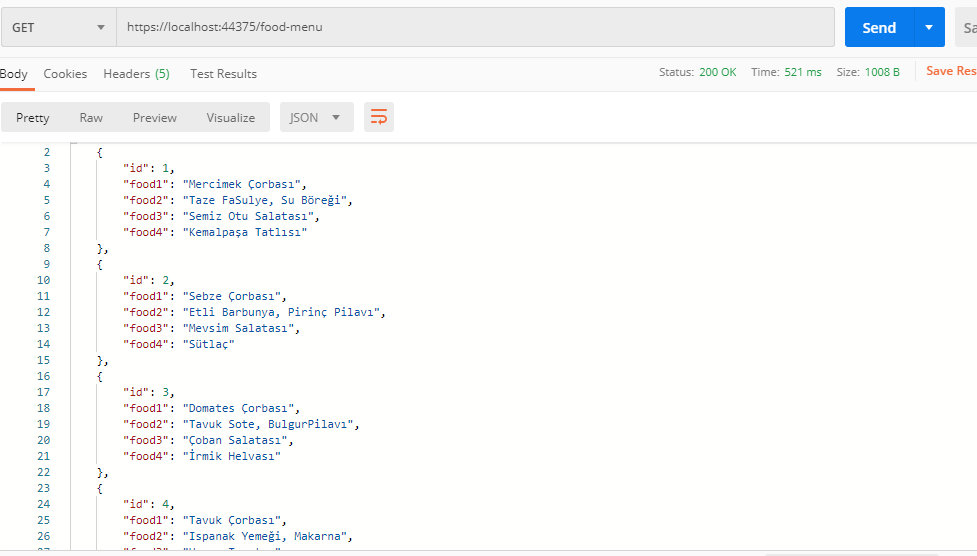
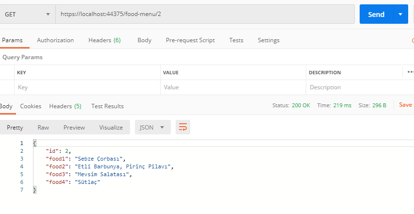
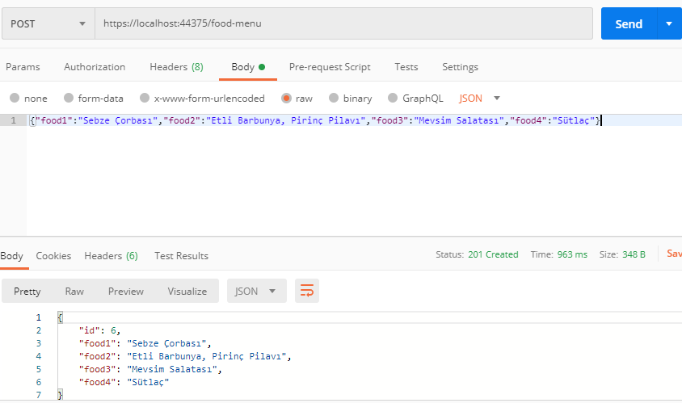
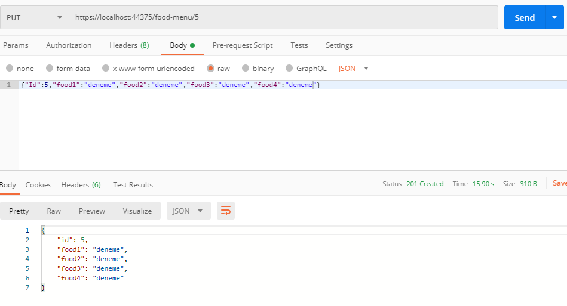
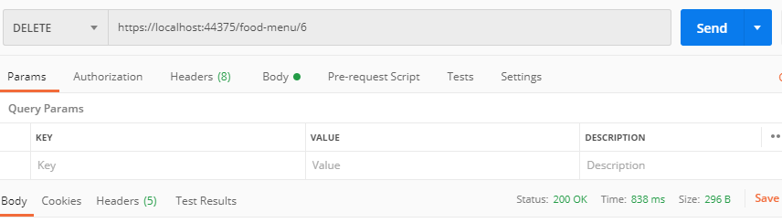

# MenuAPI
*This API has **SeedData**.You can add,delete,update,list the data by ***POSTMAN with GET,POST,PUT,DELETE*** methods.*

*A simple API example including 4x4 different food menus, You can test this API with ***Postman****
 
 
<H2>TEST EXAMPLES</H2>
<h3>GET</h3>
 

 
 
 

<h3>GET by ID </h3>
 

 
 
 

<h3>POST</h3>
 

 
 
 

<h3>PUT</h3>
 

 
 
 

<h3>DELETE</h3>
 

 
 
 

